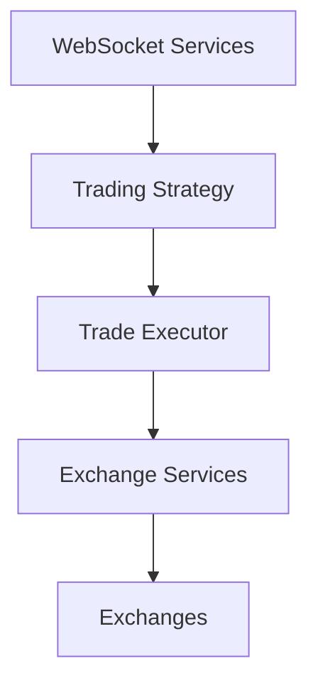

# Crypto Arbritage

NestJS + CCXT + WebSocket + RxJS

## 1. 系统架构

### 1.1 核心模块
- **WebSocket 服务层**：实时市场数据监听
  - BaseWebSocketService：基础 WebSocket 功能
  - TickerService：价格行情监听
  - OrderBookService：订单簿监听
  - BalanceService：余额变动监听

- **交易所接入层**
  - BaseExchangeService：统一交易所接口
  - 具体实现：GateioService、BinanceService、OkxService

- **策略层**
  - TradingStrategyService：交易策略实现
  - TradeExecutorService：交易执行

- **工厂层**
  - WebSocketFactoryService：WebSocket 服务管理

### 1.2 数据流


## 2. 核心功能设计

### 2.1 WebSocket 服务
- 统一的连接管理
- 自动重连机制
- 市场数据加载重试
- 交易所特定格式转换

### 2.2 交易所集成
- CCXT Pro 标准接口
- 统一的错误处理
- 交易对格式转换
- 配置化的交易所支持

### 2.3 策略实现
- 多交易所价格对比
- 订单簿套利分析
- 可配置的交易阈值
- 风险控制参数

## 3. 配置管理
```typescript
trading: {
  symbols: {
    'SEAL/USDT': {
      exchanges: ['gate'],
      thresholds: {...}
    }
  }
}
```

## 4. 扩展性设计

### 4.1 新交易所接入
1. 继承 BaseExchangeService
2. 实现特定接口
3. 添加配置项
4. 注册到工厂服务

### 4.2 新策略添加
1. 创建新的策略服务
2. 实现策略接口
3. 配置策略参数
4. 注册到策略管理器

### 4.3 监控指标扩展
1. 添加新的 WebSocket 服务
2. 实现数据处理逻辑
3. 注册到工厂服务
4. 在策略中使用

## 5. 潜在优化方向

### 5.1 性能优化
- WebSocket 连接池
- 数据缓存层
- 消息队列集成
- 并发控制优化

### 5.2 功能扩展
- 更多交易所支持
- 更复杂的策略模型
- 风险管理系统
- 性能监控系统

### 5.3 可靠性提升
- 故障转移机制
- 交易验证层
- 资金安全控制
- 日志审计系统

## 6. 开发规范

### 6.1 代码组织
```
src/
  ├── services/
  │   ├── websocket/
  │   ├── exchange/
  │   └── strategy/
  ├── config/
  ├── types/
  └── utils/
```

### 6.2 错误处理
- 统一的错误类型
- 错误日志记录
- 优雅降级策略
- 自动恢复机制

### 6.3 测试策略
- 单元测试覆盖
- 集成测试
- 模拟交易测试
- 性能测试
```

这个设计文档提供了系统的整体架构、核心功能和扩展性考虑。它可以作为开发指南和后续维护的参考。
